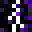

#  Struck Obsidian [Fabric]

## Features
- supported environments: **[ *client+server* || *server-only* ]**
- **all features are configurable** (path: *`/config/struckobsidian.json5`*)
    - with [Mod Menu](https://www.curseforge.com/minecraft/mc-mods/modmenu) support!
- during a thunderstorm, place a lightning rod on top of an obsidian block
- converts obsidian to crying obsidian when lightning strikes the rod
- placing down multiple obsidian blocks underneath the rod has a chance of converting more blocks
- change the source block behaviour when lightning strikes again: `NONE` or `DESTROY`
- branch and spreading parameters can be adjusted to your liking
